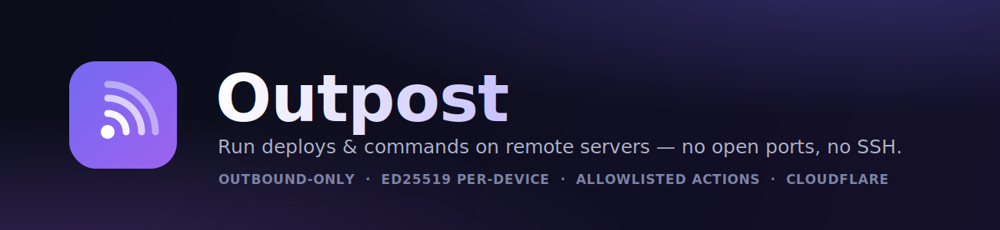

<p align="center">
  
</p>

<p align="center">
  <a href="https://github.com/aryanvikash/outpost/actions/workflows/ci.yml"></a>
  <a href="https://github.com/aryanvikash/outpost/releases"></a>
  <a href="./LICENSE"></a>
  <a href="./agent"></a>
  <a href="./control-plane"></a>
  <a href="./PROTOCOL.md"></a>
</p>

<p align="center">
  <b>Securely run commands (initially: deployments) on remote Linux servers from a
  central control plane — without opening any inbound ports and without SSH.</b>
</p>

A thin **agent** (a single static Go binary) runs on each server and dials
**outbound** over WebSocket Secure to a **control plane** running entirely on
Cloudflare (a Worker + Durable Objects + D1). The control plane pushes **jobs**
down that connection; the agent executes them from a **fixed allowlist of named
actions** (never arbitrary shell), streams logs back, and reports an exit status.

Because the agent only ever connects *out*, the managed server can keep **all
inbound ports closed — including 22.**

```
 Agent (Go, on each server)          Cloudflare                      Storage
 ---------------------------         --------------------------      --------------
 wss outbound  ──────────────►   Worker (front door, Hono)
   • 1 live socket                  • terminates wss, validates token
   • allowlisted actions only       • routes to the machine's DO
   • streams logs up                       │
   • heartbeat + reconnect                 ▼
                                  Durable Object  (ONE per machine)
                                    • IS the WebSocket server (Hibernation API)
                                    • per-machine job queue + state (SQLite)
                                    • pushes jobs, collects logs/results
                                           │
                                           ▼
                                  D1 (fleet-wide)
                                    • machines + hashed tokens
                                    • job history + audit log
```

## Trust model (read this first)

- **Connection direction is the core security property.** The agent is the
  client; the Durable Object is the WebSocket server. This is what lets the
  managed box keep every inbound port closed, and it's required for the
  Hibernation API.
- **No arbitrary command execution.** The control plane sends a *named action*
  from a vetted allowlist plus a *validated params* object — never a command
  string. Adding an action is a code change, reviewed in a PR. The mapping from
  action → concrete commands lives only in the agent.
- **Devices hold their own keys.** Each agent generates an Ed25519 keypair on the
  box; the control plane stores only the public key and verifies a per-connect
  signature. A control-plane/D1 leak exposes no usable device credential. See
  [`ENROLLMENT.md`](./ENROLLMENT.md).
- **The control plane is the trust anchor.** Compromising the Worker means
  command over connected agents, so the allowlist is the blast-radius limiter.
  See [`SECURITY.md`](./SECURITY.md).
- **The wire protocol is a public, versioned contract:** [`PROTOCOL.md`](./PROTOCOL.md).

## Repository layout

```
agent/            Go agent (single static binary)         → agent/README.md
control-plane/    Cloudflare Worker + Durable Object + D1  → control-plane/README.md
web/              Admin dashboard (React + Vite + TanStack)→ web/README.md
PROTOCOL.md       Versioned wire-protocol spec (source of truth)
install.sh        curl|sh installer (OS/arch detect, checksum verify, systemd)
.goreleaser.yaml  Cross-compile, checksums, cosign signing, deb/rpm, Docker
packaging/        systemd unit, sudoers example, nfpm scripts, Dockerfile
```

Each component has its own README for using it standalone:
**[agent](./agent/README.md)** · **[control plane / API](./control-plane/README.md)** ·
**[web dashboard](./web/README.md)**. The wire contract between agent and control
plane is [`PROTOCOL.md`](./PROTOCOL.md).

## Quick start

### 1. Deploy the control plane

```sh
cd control-plane
npm install
npm run deploy     # wrapper: login → create D1 + patch wrangler.toml →
                   # migrate → deploy → generate/set ADMIN_TOKEN (shown once)
```

`npm run deploy` (a.k.a. `./deploy.sh`) is idempotent — re-run it for every
deploy. First run does the one-time setup; later runs just migrate + deploy.
Other commands: `./deploy.sh setup` (setup only), `./deploy.sh migrate` (remote
migrations only), `./deploy.sh deploy:raw` for a bare `wrangler deploy`.

Local dev instead: `npm run dev` (applies local migrations, writes a throwaway
`.dev.vars`, and starts `wrangler dev` on `http://localhost:8787`).

### 2. Mint an enroll token

Devices authenticate with their own Ed25519 keypair (generated on the device; the
private key never leaves it). To authorize a device's first registration, mint a
short-lived **enroll token**:

```sh
curl -X POST https://<your-worker>/api/enroll-tokens \
  -H "Authorization: Bearer $ADMIN_TOKEN" -H 'Content-Type: application/json' \
  -d '{"label":"web-1","uses":1,"expiresInMinutes":60}'
# → { "id":"et_…", "token":"oet_…", "uses":1, "expiresAt":… }   # token shown once
```

### 3. Install + enroll the agent on the server

```sh
curl -fsSL https://raw.githubusercontent.com/aryanvikash/outpost/main/install.sh | \
  OUTPOST_URL=wss://<your-worker>/connect OUTPOST_ENROLL_TOKEN=oet_… sh
```

The installer runs `outpost-agent add`, which generates the device keypair,
registers the **public** key, writes the private key to `/etc/outpost/agent.key`
(`0600`), and connects. The enroll token is then spent.

See **[ENROLLMENT.md](./ENROLLMENT.md)** for the full identity/enrollment model.

### 4. Run a job

```sh
# Smoke test:
curl -X POST https://<your-worker>/api/machines/m_…/jobs \
  -H "Authorization: Bearer $ADMIN_TOKEN" -H 'Content-Type: application/json' \
  -d '{"action":"healthcheck"}'
# → { "jobId": "j_…", "status": "dispatched" }

# Watch it:
curl https://<your-worker>/api/jobs/j_… -H "Authorization: Bearer $ADMIN_TOKEN"
curl https://<your-worker>/api/jobs/j_…/logs -H "Authorization: Bearer $ADMIN_TOKEN"

# Deploy:
curl -X POST https://<your-worker>/api/machines/m_…/jobs \
  -H "Authorization: Bearer $ADMIN_TOKEN" -H 'Content-Type: application/json' \
  -d '{"action":"deploy","params":{"branch":"main"}}'
```

## Closing inbound ports

The whole point: the managed server needs **no** inbound rules. Lock it down.

**AWS security group** — remove all inbound rules (including SSH/22). Egress 443
is enough.

**ufw**
```sh
sudo ufw default deny incoming
sudo ufw default allow outgoing
sudo ufw enable
```

## Actions (v1)

| action        | params                | what it does                          |
|---------------|-----------------------|---------------------------------------|
| `healthcheck` | —                     | returns host info (the smoke test)    |
| `deploy`      | `{ "branch": "..." }` | host deploy hook, else `git pull` + `npm ci` + `pm2 reload` |
| `restart`     | `{ "app": "..." }`    | `pm2 reload <app>`                    |
| `run-hook`    | `{ "name": "..." }`   | run a host-defined hook script (custom command) |

Deploy targets (app dir, PM2 target, git remote) are **agent-side config**, set
via the systemd unit's `Environment=` — they are never supplied over the wire.
The only operator-supplied deploy input is the branch, which is strictly
validated. The agent needs a narrow `sudoers` grant for its deploy commands; see
[`packaging/sudoers/outpost-agent`](./packaging/sudoers/outpost-agent).

### Custom commands (host hooks)

For any stack (Python/supervisor, docker-compose, a `pull`/`migrate` step, …),
drop an executable script in the agent's hooks dir and run it by name — **no
command string ever crosses the wire**. The hooks dir is `$OUTPOST_HOOKS_DIR`,
defaulting to:

- **`~/.config/outpost/hooks/`** for a rootless/user install (no sudo), or
- **`/etc/outpost/hooks/`** for the systemd system service.

```sh
# rootless (no sudo):
install -D -m 0755 packaging/hooks/deploy.example ~/.config/outpost/hooks/deploy
# system service:
sudo install -D -m 0755 packaging/hooks/deploy.example /etc/outpost/hooks/deploy
```

- `deploy` runs `<hooks>/deploy` if present (else the built-in PM2 flow).
- `run-hook` runs any `<hooks>/<name>` — these surface in the dashboard as
  one-click **Custom commands** buttons.
- The agent **refuses** a hook that is group/world-writable (so other users on the
  box can't tamper with it). Validated params arrive as env vars
  (`OUTPOST_BRANCH`, `OUTPOST_APP_DIR`, …).

The control plane only ever sends the action/hook **name** (validated) — the
commands live on the host, authored by someone who already controls it.

## Admin dashboard (web UI)

A React dashboard lives in [`web/`](./web) — machines list, one-click enroll
(with copy-paste install command), job enqueue, and live job logs. It logs in with
the admin password and uses a short-lived JWT (the browser never holds the master
`ADMIN_TOKEN`).

```sh
cd web
cp .env.example .env          # set VITE_API_BASE_URL to your Worker URL
npm install && npm run dev     # http://localhost:5173
```

Requires the control plane deployed with JWT login + CORS (already included; just
`npm run deploy`). Build a static bundle with `npm run build` and host `dist/` on
Cloudflare Pages or anywhere. See [`web/README.md`](./web/README.md).

## Admin API

| method | path                          | purpose                              |
|--------|-------------------------------|--------------------------------------|
| POST   | `/api/enroll-tokens`          | mint an enroll token (one-time or fleet key) |
| GET    | `/api/enroll-tokens`          | list enroll tokens                   |
| GET    | `/api/machines`               | list machines + online status        |
| POST   | `/api/machines/:id/revoke`    | revoke a device                      |
| POST   | `/api/machines/:id/jobs`      | enqueue a job `{ action, params }`    |
| GET    | `/api/jobs/:id`               | job status + result                  |
| GET    | `/api/jobs/:id/logs`          | streamed logs for a job              |
| POST   | `/api/jobs/:id/cancel`        | request cancellation                 |
| POST   | `/api/bindings`               | bind `repo + branch → machine/action` |
| GET    | `/api/bindings`               | list repo→machine bindings           |
| DELETE | `/api/bindings/:id`           | remove a binding                     |

All admin routes require `Authorization: Bearer $ADMIN_TOKEN`. Device-facing
routes are separate: `POST /enroll` is authorized by an **enroll token**, and
`GET /connect` by a **device-signed JWT** — never the admin token.

## Auto-deploy on push

Outpost can deploy automatically when you push. The control plane verifies an
HMAC signature on each webhook delivery, looks up `repo + branch` bindings, and
enqueues the bound action (default: `deploy` that branch). **GitHub** and
**Bitbucket** are both supported.

### GitHub App

Install a **GitHub App** on a repo and `push` events flow to the control plane
natively (no per-repo webhook to create). On a matching push it enqueues the bound
action and posts a commit status (pending → success/failure) back to the commit.

1. **Create a GitHub App** (Settings → Developer settings → GitHub Apps):
   - Webhook URL: `https://<your-worker>/webhooks/github`
   - Webhook secret: a random string
   - Subscribe to events: **Push**
   - Permissions: *Commit statuses → Read & write* (for deploy feedback)
   - Generate a private key (downloads a PKCS#1 `.pem`).
2. **Configure the Worker secrets:**
   ```sh
   wrangler secret put GITHUB_WEBHOOK_SECRET     # the webhook secret
   # convert the key once, then store it:
   openssl pkcs8 -topk8 -inform PEM -outform PEM -nocrypt -in app.pem -out app.pkcs8.pem
   wrangler secret put GITHUB_APP_PRIVATE_KEY    # paste app.pkcs8.pem
   # set GITHUB_APP_ID in wrangler.toml [vars]
   ```
3. **Bind a repo+branch to a machine:**
   ```sh
   curl -X POST https://<your-worker>/api/bindings \
     -H "Authorization: Bearer $ADMIN_TOKEN" -H 'Content-Type: application/json' \
     -d '{"repo":"acme/web","branch":"main","machineId":"m_…"}'
   ```
4. **Install the App** on that repository.

Now `git push origin main` to `acme/web` runs `deploy {branch:"main"}` on the
bound machine, with status reported on the commit. Only the `GITHUB_WEBHOOK_SECRET`
is required to accept deliveries; the App id/key are only needed for commit-status
feedback. Without them, Phase 6 is inactive.

### Bitbucket

Bitbucket uses a **per-repo webhook** (no App model). On a matching `repo:push` it
enqueues the bound action; a single push can touch several branches and each is
handled.

1. **Add the webhook** (Repository settings → Webhooks → Add webhook):
   - URL: `https://<your-worker>/webhooks/bitbucket`
   - Secret: a random string
   - Triggers: **Repository push**
2. **Configure the Worker secrets:**
   ```sh
   wrangler secret put BITBUCKET_WEBHOOK_SECRET   # the webhook secret
   wrangler secret put BITBUCKET_ACCESS_TOKEN     # optional: commit build-status feedback
   ```
3. **Bind a repo+branch to a machine** (same `/api/bindings` call as above; use the
   `workspace/repo` slug).

The `BITBUCKET_WEBHOOK_SECRET` is required to accept deliveries; the access token
is only needed for build-status feedback. See
[`control-plane/README.md`](./control-plane/README.md#auto-deploy-on-push) for the
current scope (push→deploy is complete; terminal build-status feedback is a
documented follow-up).

## Development

```sh
# Agent
cd agent && go test ./... && go vet ./...

# Control plane
cd control-plane && npm run typecheck && npm test
```

Defaults: heartbeat **30s**, job timeout **300s** (override per-job with
`timeoutSec`). Build phases and their tests are documented in
[`prompt.txt`](./prompt.txt) §9.

## License

[Apache-2.0](./LICENSE).
